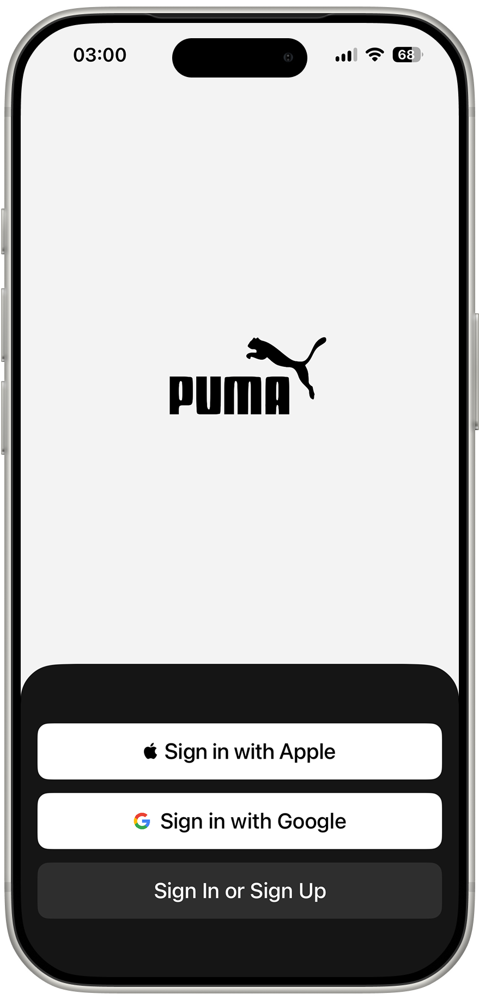
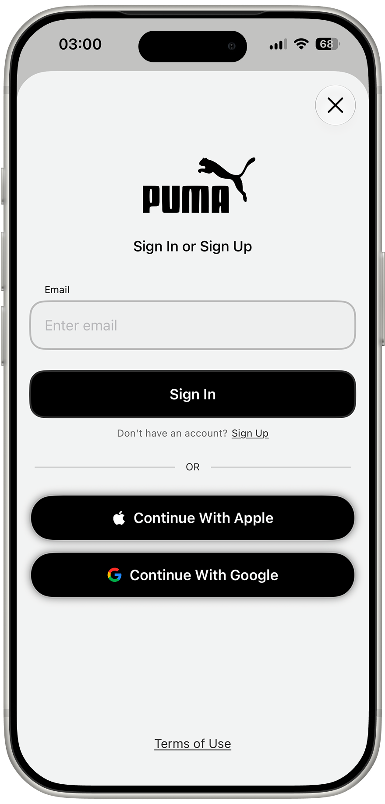
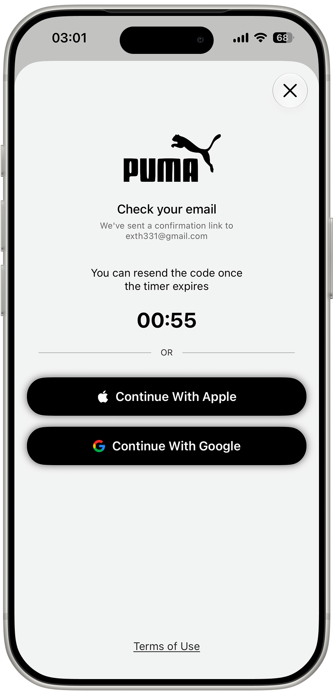
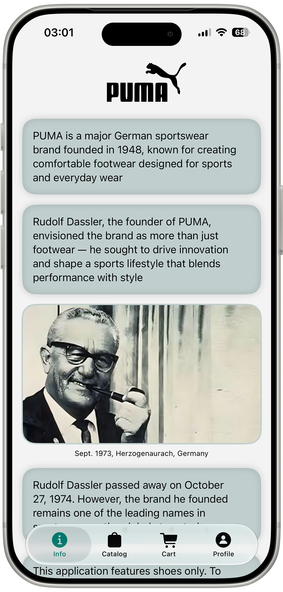
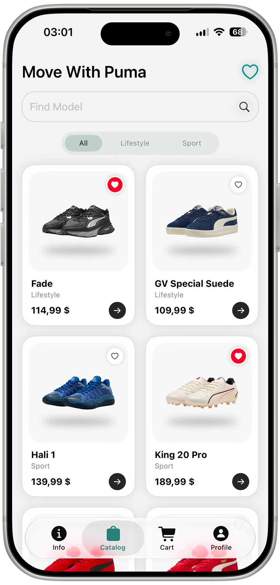
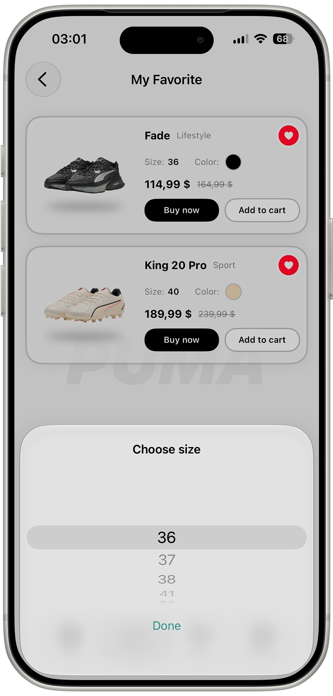
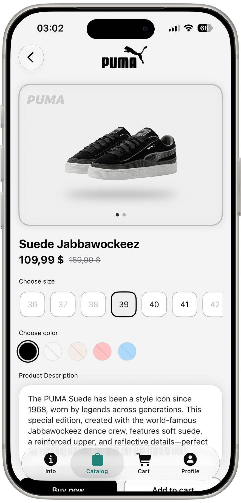
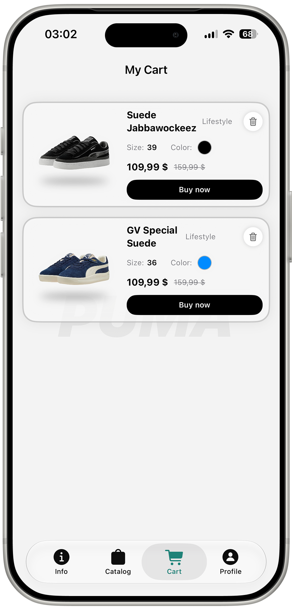
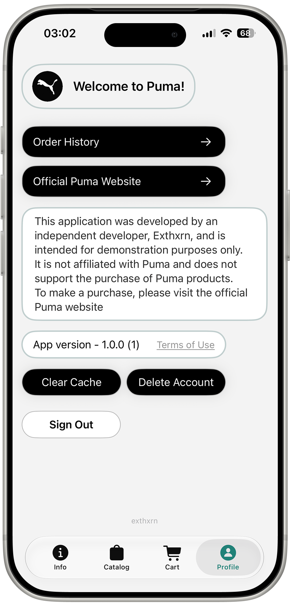

<h1 align="center">Puma — iOS Sneaker Store</h1>
 

  A fully-featured e-commerce app for browsing and shopping PUMA sneakers, built with SwiftUI, Firebase and MVVM.

## Table of Contents

- [Screenshots](#screenshots)
- [Overview](#overview)
- [Features](#features)
- [Architecture](#architecture)
- [Tech Stack](#tech-stack)
- [Testing](#testing)
- [Design](#design)
- [Requirements](#requirements)
- [Disclaimer](#disclaimer)
- [Author](#author)

## Screenshots

<table>
  <tr>
    <td></td>
    <td></td>
    <td></td>
  </tr>
  <tr>
    <td></td>
    <td></td>
    <td></td>
  </tr>
    <tr>
    <td></td>
    <td></td>
    <td></td>
  </tr>
</table>

## Overview

**Puma** is an independent, non-commercial demo e-commerce app inspired by the official PUMA shopping experience. Users can sign up or sign in, browse a live product catalog pulled from Firebase, save favorites, build a cart, and manage their account — all within a custom-built interface.
 
The app is fully functional on iPhone and works well on iPad, though the iPad layout would need further polish for a full App Store release targeting tablets. The entire backend — authentication, product data, and account management — is powered by **Firebase**.

## Features
 
### Authentication
- Sign in with **Apple**
- Sign in with **Google**
- Custom multi-step **email/password** flow:
  - Email input with format validation
  - **Sign Up** → password creation with live validation rules (10+ characters, at least one number and one special character)
  - Email verification screen with a resend timer and automatic polling — the app detects verification and logs the user in as soon as they confirm the link from their inbox
  - **Sign In** for existing accounts, including a "Forgot Password" reset-link flow
- Persistent session across app launches
- Sign out
- **Delete Account** flow with two-step, destructive confirmation (irreversible action)
  
### Info
- Brand story screen shown on first login — a short history of PUMA and its founder, Rudolf Dassler

### Catalog
- Product list loaded live from **Cloud Firestore**
- Local caching layer: catalog loads instantly from cache on launch and silently refreshes from the network in the background
- Filter by category (All / Lifestyle / Sport) with an animated selection indicator
- Live search by model name, with a dedicated "no results" state
- Pull-to-refresh
- Network error state with a retry action
  
### Product Details
- Two-image carousel with a page indicator
- Size and color selection with real-time availability indication
- Add to Cart / Buy Now (Buy Now surfaces a "coming soon" alert — purchases are redirected to the official PUMA website, as this app does not process real transactions)
  
### Favorites
- Add or remove favorites directly from a product card
- Dedicated Favorites screen with inline size/color pickers and one-tap "Add to Cart"
- Empty state placeholder
  
### Cart
- Add products with the exact size and color the user selected
- Remove items with an animated transition
- Empty state with a call-to-action back to the catalog
  
### Profile
- Clear local image and product cache
- Delete account (two-step confirmation, synced with Firebase)
- Sign out
- Link to the official PUMA website
- Custom **Terms of Use** page — a standalone page written and hosted by the author, opened in-app via Safari
- App version display

## Tech Stack
- **Swift 6** / **SwiftUI**
- **Firebase Authentication** (Email/Password, Sign in with Apple, Sign in with Google)
- **Cloud Firestore** — product catalog storage
- **Kingfisher** — async image loading & caching
- **Sign In with Apple** / **Google Sign-In SDK**
- **XCTest** — unit testing
- **MVVM + Coordinator** architecture
- Swift **Observation framework** (`@Observable`)
- iOS 18.6+
- Xcode 16+

## Testing
 
The project includes a dedicated unit test suite built with `XCTest`, organized into:
 
- `AuthorizationTests` — email/password/session ViewModels
- `CartTests` — cart card & cart ViewModels
- `CatalogTests` — catalog, product detail, favorites ViewModels
- `CoreTests` — `CartManager`, `FavoritesManager`, `SessionManager`
- `ProfileTests` — profile ViewModel

## Disclaimer
 
This app is an independent, unofficial project built for educational and portfolio purposes only. It is **not affiliated with, endorsed by, or connected to PUMA SE** in any way, and does not support or process real purchases of PUMA products. To buy real products, please visit the [official PUMA website](https://us.puma.com).

Built by **Exthxrn**

